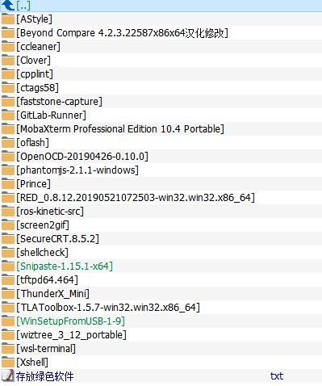

# 研发新电脑启用+搭建linux开发环境

## 新PC领用

### 磁盘分区

使用自带的分区工具分CDEF区，以1T硬盘为例，C盘200G，D盘250G，E盘250G，F盘200G

若固态+机械，则固态作系统磁盘

### 用户文件夹迁移到D盘

资源管理器-文件夹右击-属性-位置-移动

### 页面文件换到D盘

右击点击“计算机”-属性-高级系统设置-高级-设置（性能项下面的这个）-高级-更改-点选C盘（自动管理……前面的框别选）-单选“无分页文件（N）”-“设置”，此时C盘中的虚拟内存就消失了；然后选中D盘，单选“自定义大小”-在下面的“初始大小”和“最大值”两个文本框中输入数值-“设置”-确定-重启，便完成了设置。

### 索引重建到D盘

- 在Win10任务栏的Cortana搜索框中输入“索引选项”，点击搜索结果中的“索引选项（控制面板）”打开“索引选项”窗口。点击窗口底部的“高级”按钮，打开“高级选项”窗口；
- 在“索引位置”区域点击右下角的“选择新位置”按钮，为Windows.edb选择非系统盘的路径即可。最后点击“确定”，重启电脑后生效；

### 配置Windows功能

#### 关闭功能

- XPS文档写入服务
- 旧版组件
- 若需要则把windows defender默认杀毒关掉

#### 开启功能

- hyper v
- netframework
- print to pdf
- nfs
- simple tcp/ip
- telnet client
- tftp client
- Windows linux subsystem

### windows 设置

- 设置墙纸等
- 将windows app安装位置移动到D盘
- 关闭cotana等的各种提示
- 关闭不必要的启动项
- 总之要把Windows 设置全部看一遍

## 安装软件

### 绿色软件

绿色软件安装在/d/opt/，绿色软件的配置和软件是一起的，一旦配置好容易迁移

### 日常软件包

### 效率软件包

### 开发软件包

### 虚拟机配置

## 虚拟机Linux软件安装

